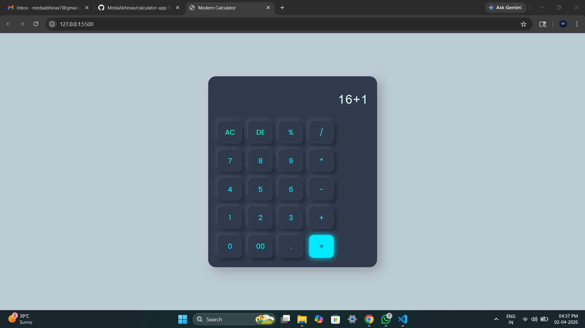

🔢 Modern Calculator App

A sleek and modern calculator web application built using HTML, CSS, and JavaScript.
This project features a neumorphism UI design with soft shadows and glowing button effects for a premium user experience.

---

📸 Screenshot

---

🚀 Features

- 🧮 Perform basic arithmetic operations (+, −, ×, ÷, %)
- 🎨 Modern neumorphism UI design
- 💡 Glowing button hover effects
- 🧼 Clear (AC) and Delete (DE) functionality
- ⚡ Fast and responsive interface

---

🛠️ Tech Stack

- HTML5 – Structure
- CSS3 – Styling (Neumorphism UI)
- JavaScript – Logic & Functionality

---

📂 Project Structure

calculator-app/
├── index.html
├── style.css
├── script.js
└── screenshot.png

---

▶️ How to Run Locally

1. Clone the repository:

git clone https://github.com/MedaAbhinav/calculator-app.git

2. Open folder in VS Code

3. Run using Live Server

---

📌 Future Improvements

- ⌨️ Keyboard input support
- 📱 Fully responsive mobile design
- 🔒 Secure calculation (without eval)
- 📊 Scientific calculator features

---

🙌 Author

Abhinav Meda

---
